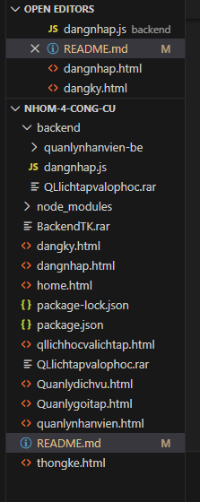

🏋️‍♂️ Website Quản Lý Phòng Gym – GYM MANAGEMENT WEB

1. Giới thiệu

Website Quản Lý Phòng Gym là một hệ thống quản lý cơ bản dành cho phòng tập, hỗ trợ theo dõi và quản lý:

Hội viên

Gói tập

Thiết bị

Nhân viên

Doanh thu thống kê

Đăng nhập / đăng ký tài khoản

Giao diện trực quan, dễ sử dụng

Website được xây dựng bằng HTML / CSS / JavaScript thuần, phù hợp cho mục đích học tập và làm bài tập lớn.

2. Cấu trúc project

   

3. Hướng dẫn cài đặt

🔹 Bước 1: Clone hoặc tải project

🔹 Bước 2: Mở project

🔹 Bước 3: Chạy website 4. Chức năng các trang
🔵 1. Đăng nhập – login.html

Nhập tài khoản, mật khẩu

Kiểm tra hợp lệ

Ghi nhớ tài khoản

Lưu tạm bằng js

🔵 2. Đăng ký – register.html

Nhập thông tin người dùng

Validate các trường

Lưu tạm bằng localStorage / JS

🔵 3. Quản lý hội viên – member.html

Thêm – sửa – xóa hội viên

Danh sách hội viên

Tìm kiếm theo tên / số điện thoại

🔵 4. Quản lý gói tập – service.html

Tạo gói tập mới

Chỉnh sửa gói tập

Xóa gói tập

Hiển thị danh sách gói tập

🔵 5. Quản lý thiết bị – equipment.html

Danh sách thiết bị

Số lượng, tình trạng

Thêm – sửa – xóa thiết bị

🔵 6. Thống kê – statistic.html

Thống kê số hội viên

Doanh thu ước tính

Dữ liệu demo bằng JavaScript

5. Công nghệ sử dụng

HTML5

CSS3

JavaScript thuần

Font Awesome 6.5

6. Ghi chú

Website hiện tại chỉ là front-end tĩnh,
👉 Chưa có cơ sở dữ liệu và backend thật.
